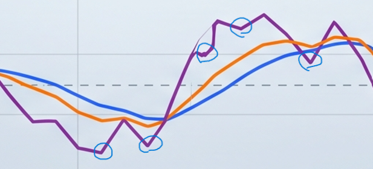
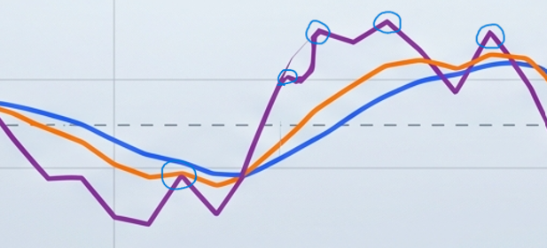
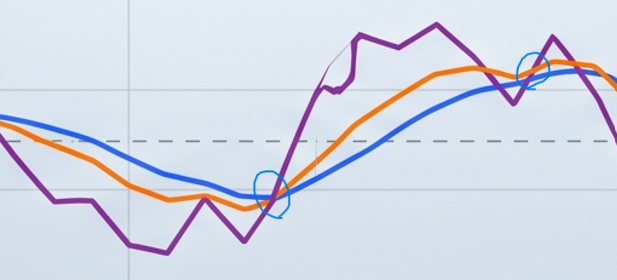
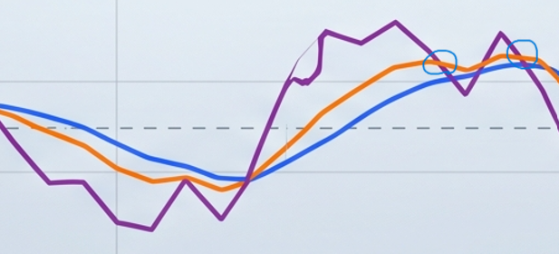

---
title: KD 指標找買點
parent: Home
nav_order: 7
---

# KD 指標找買點

因為我想保留一點交易的樂趣, 所以我投資組合中 30.0% Taiwan Top 10 不採用定時定額, 而是使用 KD 指標找買點.

儘管不採用定時定額, 我還是保留了定額這個屬性. 也就是說我只是從 "定時定額" 小改成 "不定時定額".

如果你還不熟悉 KD 指標, 建議先補一點基本知識再來看這篇買進規則.

---
[Reference: KD 指標實戰](#reference)

> 記得一定要使用: 還原日, 還原週, 還原月, 否則發股利的時候, 指標就不準了.

## 4 Patterns
有 4 個 Pattern 一定要先會認.

### 轉折向上



### 轉折向下



### 黃金交叉



### 死亡交叉



## 觀測頻率對照表
接下來我們就可以開始觀察 KD 指標, 決定我們是否要買進, 以及買進多少金額.

千萬不要一直盯盤, 那只是在浪費生命, 還會影響你的工作. 定時觀測即可.

觀測頻率分為每日, 每週, 每月; 對應不同的觀察指標以及 T-Shirt Sizing 額度. 每日額度最小, 每月額度最高. 

當觀測時間到了, 你就觀察一下是不是有哪一檔個股符合買進的交易規則. 如果符合, 就用相對應的 Size 額度買進固定的金額.

| 頻率 | 觀察指標  | T-Shirt Size | 公式                                        | Example                              |
| ---- | -------- | ------------ | ------------------------------------------- | ------------------------------------ |
| 每日 | 還原日 KD | S            | 可投入總金額 * 投資組合比例 / 10 擋個股 / 100 | 8,000,000 * 30% / 10 / 100 =   2,400 |
| 每週 | 還原週 KD | M            | 可投入總金額 * 投資組合比例 / 10 擋個股 / 10  | 8,000,000 * 30% / 10 / 10  =  24,000 |
| 每月 | 還原月 KD | L            | 可投入總金額 * 投資組合比例 / 10 擋個股       | 8,000,000 * 30% / 10       = 240,000 |

有了這些簡單的規則, 你每天花在研究買點的時間會非常少. 利用吃飯時間就可以快速決定要不要買進, 以及要買多少.

例如: 
- 每天中午 12 點吃飯時, 觀測一次還原日 KD, 若符合買進的交易規則, 則買進 S size 的金額.
- 每週五中午 13 點飯後, 觀測一次還原週 KD, 若符合買進的交易規則, 則買進 M size 的金額.
- 每個月月底最後一個交易日, 觀測一次還原月 KD, 若符合買進的交易規則, 則買進 L size 的金額.

如此一來, 你可以更專注於你的本職學能以及你的本業. 

君子務本, 本立而道生. 投資理財, 大道至簡.

## 交易規則
交易規則只有兩條.

Rule 1
```
Given:
出現轉折向上 pattern

When:
本次還原 K 指標在 20 以下
And
出現黃金交叉 pattern

Then:
買進
```

Rule 2
```
Given:
出現轉折向上 pattern

When:
本次還原 K 指標在 20-80 之間

Then:
買進
```

每個轉折只買一次. 不要 Rule 1 買了一次, 過幾天 K 進入 20-80 區間符合 Rule 2, 又再買一次.

## Reference

- KD 指標實戰 - <https://youtu.be/gksOIi3syH4?si=iKOI_wBrRj_MmlQh>